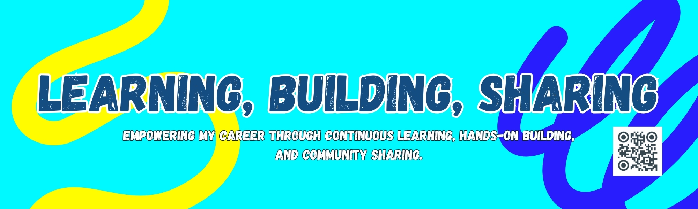

<!-- Background Image -->
<div align="center">
  
</div>

<br/>

<div align="center">
  
</div>

---

<h4 align="center">🚀 Turning Innovative Ideas into Digital Reality</h4>

<div align=center>
        
</div>

</div>
<div align="center" style="margin-top:10px;">
  
  
  
</div>
<br/>

```javascript
const Thisara = {
    name: "Thisara Dasun",
    location: "Sri Lanka, Kandy",
    email: "thisarad28@gmail.com",
    phone: "+94789854096",
    code: ["JavaScript", "Python", "Java", "C#", "Dart", "C++"],
    askMeAbout: ["web dev", "mobile dev", "DevOps", "IOT", "AI/ML", "ui/ux design"],
    technologies: {
        library: ["React.js", "Flutter"],
        framework: ["Next.js", "Flutter", "Spring Boot"],
        backEnd: ["Node.js", "PHP", "Express", "Spring Boot"],
        devOps: ["Docker", "Firebase"],
        databases: ["MongoDB", "MySQL", "Firebase"],
        misc: ["Git", "Postman", "Figma"]
    },
    architecture: [
        "Serverless Architecture", 
        "Progressive Web Applications", 
        "Single Page Applications",
        "Microservices"
    ],
    currentFocus: "Building scalable mobile and web applications",
    funFact: "There are 10 types of people in the world: those who understand binary, and those who don't 😄"
};
```
---

<h3 align="center">GitHub Statistics</h3>

<p align="center">
<table align="center">
<tr border="none">
<td width="50%" align="center">
  
  
  <br></br>
   
</td>

<td width="50%" align="center">
  
  <br></br>

</td>
</tr>
</table>
</p>

---

<h3 align="center">Connect with me</h3>

<div align="center">
<a href="https://www.linkedin.com/in/jeewaka-supun" target="blank"></a>
  &nbsp;
<a href="https://mail.google.com/mail/?view=cm&to=thisarad28@gmail.com" target="blank"></a>
</div>

---
<h3 align="center">Languages and Tools</h3>

<div align="center">
  
  
   
 
  
   
 
 </div>
 
---

<h3 align="center">Contribution Snake</h3>

<!-- Snake Animation -->
<div align="center">
  
</div>

---

<h3 align="center">Random Dev Quote</h3>

<div align="center">
  
</div>

<div align="center">  </div>

<h4 align="center">Looking forward to connecting with you! 🚀</h4>
